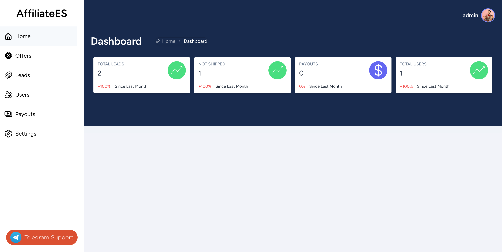
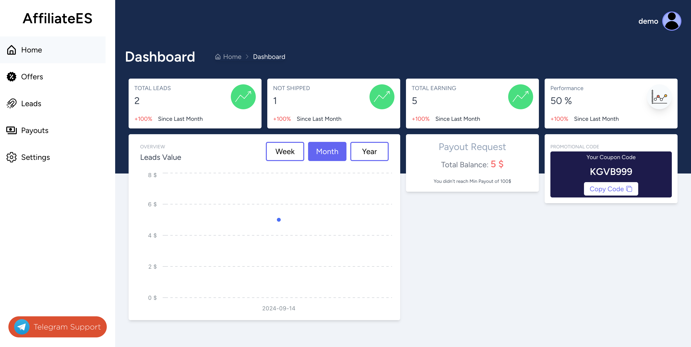
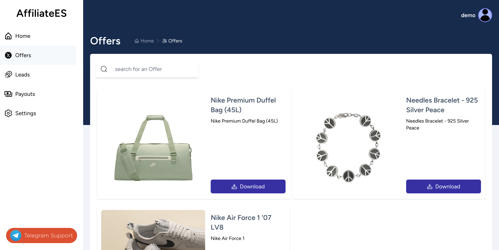
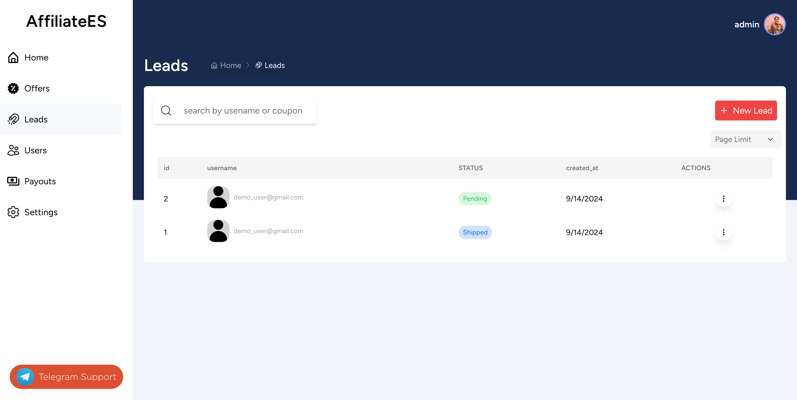

# Affiliate Website Project

A powerful and feature-rich affiliate website built with Laravel, MySQL, React, and Redux. This project offers a comprehensive solution for managing affiliate marketing campaigns, tracking leads, and analyzing performance through intuitive dashboards for both administrators and users.

## Table of Contents

- [Features](#features)
- [Tech Stack](#tech-stack)
- [Screenshots](#screenshots)
- [Demo](#demo)

## Features

- **User Authentication**: Secure login and registration system for both administrators and affiliates.
- **Admin Dashboard**: Comprehensive overview of site performance, user management, and offer control.
- **User Dashboard**: Personalized dashboard for affiliates to track their performance and manage campaigns.
- **Offer Management**: Create, edit, and manage affiliate offers with ease.
- **Lead Tracking**: Advanced lead tracking system with detailed analytics.
- **Real-time Analytics**: Up-to-date performance metrics for quick decision making.
- **Responsive Design**: Fully responsive interface for seamless use across devices.

## Tech Stack

### Backend
- Laravel (PHP Framework)
- MySQL Database

### Frontend
- React.js
- Redux for state management
- Tailwind CSS for styling

## Screenshots

### Admin Dashboard


### User Dashboard


### Offer Management


### Lead Analytics



## Demo

1. visit: 
   [affiliate.assanimed.me](http://affiliate.assanimed.me)
   

2. for Admin use:
   ```
   email: admin_user@gmail.com
   password: admin12345
   ```
2. for User use:
   ```
   email: demo_user@gmail.com
   password: demo12345
   ```
